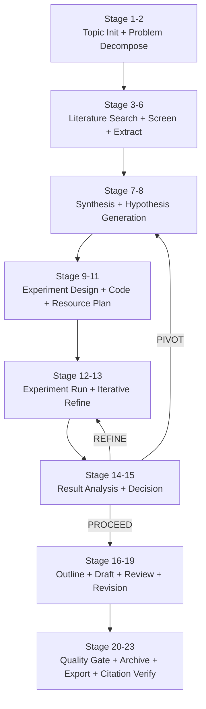

# AutoResearchClaw

一句话：
AutoResearchClaw 是 Karpathy autoresearch 思路的工程化扩展，目标是把自主研究从单次实验循环扩展到从 idea 到 paper 的完整流程。

## 本地资料

- 本地 README：[[AutoResearchClaw README.md|本地 README]]
- GitHub：https://github.com/aiming-lab/AutoResearchClaw

## 核心问题

- 原始 autoresearch 更像一个极简实验循环。
- 完整科研流程还需要构思、文献综述、实验设计、结果分析、写作、引用验证和人类审阅。
- 如果没有 HITL，人类很难在高风险节点把关。

## 方法

- 把研究拆成多个阶段：idea、literature review、hypothesis、experiment、analysis、paper writing、verification。
- 加入多种人机协作模式，例如 full-auto、gate-only、checkpoint、step-by-step、co-pilot。
- 强调 AI 生成的论文是 draft，需要人类 review。

## GitHub README 里的真实执行方式

README 给出的最小运行路径是：

```bash
git clone https://github.com/aiming-lab/AutoResearchClaw.git
cd AutoResearchClaw
python3 -m venv .venv && source .venv/bin/activate
pip install -e .
researchclaw setup
researchclaw init
export OPENAI_API_KEY="sk-..."
researchclaw run --config config.arc.yaml --topic "Your research idea" --auto-approve
```

输出目录形如：

```text
artifacts/rc-YYYYMMDD-HHMMSS-<hash>/deliverables/
```

里面会包含：

- `paper_draft.md`：论文草稿；
- `paper.tex`：会议模板 LaTeX；
- `references.bib`：BibTeX 引用；
- `verification_report.json`：引用与 claim 验证报告；
- `experiment runs/`：实验代码、运行结果和结构化指标；
- `charts/`：自动生成的图表；
- `reviews.md`：多 Agent peer review；
- `evolution/`：本轮运行沉淀的经验。

## 一个真实的执行示例流程

假设研究主题是：

```text
Quantum noise as neural network regularization
```

### 0. 启动方式

如果希望完全自动运行：

```bash
researchclaw run --config config.arc.yaml \
  --topic "Quantum noise as neural network regularization" \
  --auto-approve
```

如果希望人类在关键节点介入：

```bash
researchclaw run --config config.arc.yaml \
  --topic "Quantum noise as neural network regularization" \
  --mode co-pilot
```

co-pilot 模式不是每一步都打断人，而是在关键阶段让人参与，例如：

- Stage 7-8：Idea Workshop / Hypothesis generation；
- Stage 9：Baseline Navigator / Experiment design；
- Stage 16-17：Paper Co-Writer / Paper drafting；
- 其他阶段由系统自动执行，SmartPause 在低置信度、高成本或质量异常时再暂停。

### 1. Research Scoping：把一句 topic 拆成研究问题

系统先把主题拆成问题树：

```text
Topic:
Quantum noise as neural network regularization

Research questions:
1. quantum-inspired noise 是否能比 Gaussian noise 更好地提升泛化？
2. 它和 Dropout、Label Smoothing、MixUp、CutMix 相比是否有优势？
3. 不同模型规模、数据集和噪声注入位置下效果是否稳定？
```

这一步产出的是结构化研究问题、关键词、初始假设方向和后续检索计划。

### 2. Literature Discovery：拉取真实文献

系统按检索策略访问 OpenAlex、Semantic Scholar 和 arXiv，做 query expansion、去重和 relevance screening。

典型产物：

```text
literature/
  search_queries.json
  papers_raw.json
  papers_screened.json
  knowledge_cards.md
```

在 gate-only 或 co-pilot 模式下，Stage 5 会暂停让人确认文献筛选是否合理。如果人类发现漏掉关键基线论文，可以 reject 或 guide：

```bash
researchclaw reject artifacts/rc-2026-xxx \
  --reason "Missing Dropout and Label Smoothing baseline papers"

researchclaw guide artifacts/rc-2026-xxx \
  --stage 5 \
  --message "Add Dropout, Label Smoothing, MixUp, CutMix as required baselines"
```

### 3. Knowledge Synthesis：生成假设并让人改方向

系统聚类文献发现，寻找 gap，并通过 multi-agent debate 生成候选假设。

README 中给出的 co-pilot 交互类似这样：

```text
HITL | Stage 08: HYPOTHESIS_GEN
Hypotheses mentioned: 3
Novelty score: 0.72

[a] Approve  [r] Reject  [e] Edit  [c] Collaborate
[i] Inject guidance  [v] View output  [q] Abort
```

人类可以选择 `c` 进入协作聊天：

```text
Human:
Hypothesis 3 is interesting but needs Dropout/Label Smoothing as baselines.

AI:
Updated. Added Dropout, Label Smoothing, MixUp, CutMix as baselines.
```

这一轮的关键点是：人类不直接写实验，而是在假设质量、基线选择和可发表性上做方向校准。

### 4. Experiment Design：把假设变成可运行实验

Stage 9 是重要 gate。系统会生成：

- 数据集选择；
- 模型结构；
- baseline 列表；
- 主要指标；
- ablation plan；
- 资源预算；
- 可复现实验脚本。

如果实验设计缺少关键对照，人类可以 reject；如果只是小修，可以 edit 或 guide。

例子：

```bash
researchclaw guide artifacts/rc-2026-xxx \
  --stage 9 \
  --message "Use CIFAR-10 and TinyImageNet. Add Gaussian noise and Dropout as primary baselines. Keep total GPU budget under $50."
```

### 5. Code Generation 与 Experiment Execution：自动生成、运行、修复

Stage 10-13 进入代码和实验执行：

```text
10. CODE_GENERATION
11. RESOURCE_PLANNING
12. EXPERIMENT_RUN
13. ITERATIVE_REFINE
```

README 里强调这部分有几个工程护栏：

- hardware-aware execution：自动检测 NVIDIA CUDA、Apple MPS 或 CPU；
- sandbox experiments：在沙箱里运行；
- AST validation：先检查生成代码结构；
- NaN/Inf fast-fail：出现异常数值立即失败；
- self-healing repair：实验失败后最多多轮修复；
- partial result capture：失败时也保留部分结果。

如果实验跑崩，系统不是直接结束，而是进入 Stage 13：

```text
Runtime error / metric anomaly
  → diagnose failure
  → patch generated code
  → rerun experiment
  → record lesson into evolution/
```

### 6. Result Analysis：决定 Proceed、Refine 或 Pivot

Stage 14-15 做结果分析和研究决策：

```text
14. RESULT_ANALYSIS
15. RESEARCH_DECISION
```

Stage 15 有三种典型决策：

| 决策 | 含义 | 下一步 |
|---|---|---|
| PROCEED | 结果支持假设，进入写作 | Stage 16 |
| REFINE | 方向有希望，但参数或实验还要补 | 回到 Stage 13 |
| PIVOT | 原假设不成立，需要换方向 | 回到 Stage 8 |

这就是 AutoResearchClaw 相比普通 agent workflow 更像科研流水线的地方：它允许实验结果反过来改变研究方向，而不是机械执行最初计划。

### 7. Paper Writing：写作但不跳过验证

Stage 16-19 生成论文：

```text
16. PAPER_OUTLINE
17. PAPER_DRAFT
18. PEER_REVIEW
19. PAPER_REVISION
```

co-pilot 模式下，人类可以参与 Paper Co-Writer，例如要求：

```text
Introduction 不要夸大 quantum advantage；
Related Work 必须区分 quantum-inspired noise 和真实 quantum hardware noise；
Experiments 只写已经通过 VerifiedRegistry 的数字。
```

系统会做多 Agent peer review，检查 methodology 和 evidence 是否一致。

### 8. Finalization：质量门、导出和引用验证

最后阶段：

```text
20. QUALITY_GATE
21. KNOWLEDGE_ARCHIVE
22. EXPORT_PUBLISH
23. CITATION_VERIFY
```

核心产物会进入 `deliverables/`：

```text
deliverables/
  paper_draft.md
  paper.tex
  references.bib
  verification_report.json
  charts/
  experiment_runs/
  reviews.md
```

引用验证是 4 层：

```text
arXiv ID check
  → CrossRef / DataCite DOI check
  → Semantic Scholar title match
  → LLM relevance scoring
```

如果引用不存在、标题不匹配或 claim 没有文献支撑，系统会移除或标记，而不是直接写进最终稿。

## 这个流程的关键理解

AutoResearchClaw 的真实执行不是“一键生成论文”这么简单，而是一个可暂停、可回滚、可修复、可验证的 23-stage pipeline：

```text
topic
  → research questions
  → real literature
  → hypotheses
  → experiment design
  → code generation
  → sandbox run
  → self-healing repair
  → result analysis
  → PROCEED / REFINE / PIVOT
  → paper draft
  → peer review
  → citation verification
  → deliverables
```

它的价值不在于完全替代研究者，而在于把研究者从机械执行中解放出来，让人类主要把关：

- 研究问题是否值得做；
- 文献是否漏掉关键工作；
- baseline 是否公平；
- 实验预算是否合理；
- 论文 claim 是否被结果和引用支持。

## 模拟执行日志：内部如何跑完这个示例

下面是对 `Quantum noise as neural network regularization` 这个 topic 的一次纸面模拟。它不代表真实实验结果，而是用 AutoResearchClaw README 暴露的 pipeline 机制，复原一次 run 里系统可能怎样组织状态、产物和决策。

### 模拟运行上下文

```yaml
run_id: rc-20260430-153012-qnoise
topic: "Quantum noise as neural network regularization"
mode: co-pilot
human_gates:
  - stage_5_literature_screen
  - stage_8_hypothesis_gen
  - stage_9_experiment_design
  - stage_20_quality_gate
budget:
  max_cost_usd: 50
hardware:
  detected: "Apple MPS"
  fallback: "CPU"
output_root: artifacts/rc-20260430-153012-qnoise/
```

### 总览：一次 run 的状态机



### Stage 1-2：Topic Init + Problem Decompose

**输入**

```text
Quantum noise as neural network regularization
```

**内部动作**

系统先把一句话 topic 变成结构化问题树：

```json
{
  "research_problem": "Can quantum-inspired noise improve neural network generalization?",
  "candidate_mechanisms": [
    "noise injection in activations",
    "noise injection in gradients",
    "noise injection in weights"
  ],
  "comparison_targets": [
    "Gaussian noise",
    "Dropout",
    "Label Smoothing",
    "MixUp",
    "CutMix"
  ],
  "constraints": {
    "budget_usd": 50,
    "hardware": "Apple MPS or CPU fallback",
    "preferred_datasets": ["CIFAR-10", "TinyImageNet"]
  }
}
```

**产物**

```text
scoping/problem_tree.json
scoping/research_questions.md
scoping/initial_keywords.json
```

### Stage 3-6：Literature Discovery + Knowledge Extract

**内部动作**

系统扩展检索词，而不是只搜原始 topic：

```text
"quantum noise" neural network regularization
"quantum-inspired" noise injection deep learning
stochastic regularization neural networks
dropout label smoothing mixup cutmix regularization
noise injection generalization CIFAR-10
```

然后按来源拉取和筛选：

| 步骤 | 内部动作 | 目的 |
|---|---|---|
| Search strategy | 生成多组查询词 | 避免只搜到非常窄的关键词 |
| Literature collect | 从 OpenAlex、Semantic Scholar、arXiv 拉取候选文献 | 保证引用来自真实来源 |
| Deduplicate | 按 DOI、arXiv ID、标题相似度去重 | 避免同一论文重复计数 |
| Literature screen | 按相关性、年份、方法类型筛选 | 形成可读文献池 |
| Knowledge extract | 抽取方法、实验设置、指标和局限 | 为假设生成提供依据 |

**模拟筛选结果**

```json
{
  "raw_candidates": 126,
  "after_dedup": 84,
  "screened_in": 21,
  "must_include_baselines": [
    "Dropout",
    "Label Smoothing",
    "MixUp",
    "CutMix",
    "Gaussian noise injection"
  ],
  "risk_flags": [
    "quantum noise may be metaphorical rather than hardware-grounded",
    "avoid claiming quantum advantage without quantum hardware experiments"
  ]
}
```

**Stage 5 人类 gate**

```text
System:
Found 21 relevant papers. Baselines include Dropout and Gaussian noise,
but Label Smoothing / MixUp / CutMix are underrepresented.

Human:
Add Label Smoothing, MixUp, CutMix as mandatory baselines.

System:
Updated literature screen and baseline requirements.
```

**产物**

```text
literature/search_queries.json
literature/papers_raw.json
literature/papers_screened.json
literature/knowledge_cards.md
literature/baseline_requirements.json
```

### Stage 7-8：Synthesis + Hypothesis Generation

**内部动作**

系统把文献卡片聚类成几个方向：

```text
Cluster A: stochastic regularization
Cluster B: augmentation-style regularization
Cluster C: quantum-inspired randomness / distributional noise
Cluster D: robustness and calibration
```

多 Agent debate 生成 3 个候选假设：

| 假设 | 内容 | 初始判断 |
|---|---|---|
| H1 | quantum-inspired activation noise 提升 CIFAR-10 泛化 | 可测，但新意一般 |
| H2 | quantum-inspired gradient noise 改善 calibration | 有趣，但实验复杂 |
| H3 | 在小数据/高噪声场景下，quantum-inspired noise 比 Gaussian noise 更稳 | 可控、可实验、适合预算 |

**Stage 8 co-pilot 暂停**

```text
System:
HYPOTHESIS_GEN complete.
Recommended: H3
Novelty score: 0.72
Feasibility score: 0.81
Risk: possible overclaiming around "quantum"

Human:
Use H3, but frame it as "quantum-inspired distributional noise",
not real quantum hardware noise. Add Dropout, Label Smoothing,
MixUp, CutMix as baselines.

System:
Approved with edits. Updated hypothesis and baseline constraints.
```

**产物**

```text
synthesis/literature_clusters.md
synthesis/research_gap.md
hypotheses/candidates.json
hypotheses/approved_hypothesis.md
```

### Stage 9-11：Experiment Design + Code Generation + Resource Planning

**内部动作**

系统把假设转成实验矩阵：

| 维度 | 选择 |
|---|---|
| 数据集 | CIFAR-10，TinyImageNet 子集 |
| 模型 | ResNet-18，小型 CNN |
| 对照组 | baseline、Gaussian noise、Dropout、Label Smoothing、MixUp、CutMix |
| 实验组 | quantum-inspired distributional noise |
| 指标 | accuracy、ECE calibration error、robustness under label noise |
| 消融 | 噪声注入位置、噪声强度、训练轮数 |

**Stage 9 人类 gate**

```text
System:
Estimated cost: $42.30
Risk: TinyImageNet full run may exceed budget on CPU fallback.

Human:
Use TinyImageNet subset only. Keep ResNet-18 as main model.
Add a small CNN sanity check.

System:
Resource plan updated. Estimated cost: $31.80.
```

**生成的代码骨架**

```text
experiments/
  train.py
  configs/
    cifar10_resnet18_baselines.yaml
    cifar10_resnet18_qnoise.yaml
    tinyimagenet_subset_qnoise.yaml
  regularizers/
    gaussian_noise.py
    quantum_inspired_noise.py
  eval/
    metrics.py
    calibration.py
```

**产物**

```text
experiments/design.md
experiments/resource_plan.json
experiments/generated_code_manifest.json
```

### Stage 12-13：Experiment Run + Iterative Refine

**第一次运行**

```text
Run 1:
  config: cifar10_resnet18_qnoise.yaml
  status: failed
  error: NaN detected in loss at epoch 3
  suspected_cause: noise scale too high for activation injection
```

**自修复动作**

```text
diagnose:
  - check learning rate
  - check noise distribution range
  - inspect activation injection point

patch:
  - clamp sampled noise to stable range
  - reduce default noise_scale from 0.20 to 0.05
  - add NaN guard before optimizer step

rerun:
  status: success
```

**模拟结果摘要**

```json
{
  "baseline_accuracy": 0.842,
  "gaussian_noise_accuracy": 0.851,
  "dropout_accuracy": 0.856,
  "qnoise_accuracy": 0.858,
  "qnoise_ece": 0.041,
  "best_baseline_ece": 0.049,
  "warning": "accuracy gain is small; calibration gain is more consistent"
}
```

**产物**

```text
experiment_runs/run_001/log.txt
experiment_runs/run_001/error_report.json
experiment_runs/run_002/metrics.json
experiment_runs/run_002/patch_notes.md
evolution/lessons.json
```

### Stage 14-15：Result Analysis + Research Decision

**内部分析**

```text
Finding:
  qnoise does not clearly beat all baselines on accuracy.
  qnoise shows more consistent calibration improvement.

Evidence strength:
  accuracy claim: weak
  calibration claim: moderate
  robustness claim: needs refinement
```

**决策**

```text
Decision: REFINE
Reason:
  current result supports a narrower calibration-focused claim,
  but robustness under label noise has not been tested enough.

Next:
  return to Stage 13
  add label-noise robustness ablation
```

**第二轮 refine 后的模拟决策**

```text
Decision: PROCEED
Allowed claim:
  "Quantum-inspired distributional noise can modestly improve calibration
  under small-data and noisy-label settings."

Blocked claim:
  "Quantum noise outperforms classical regularization."
```

### Stage 16-19：Paper Writing + Peer Review + Revision

**写作约束**

```text
Do:
  - describe the method as quantum-inspired
  - report small accuracy gains cautiously
  - emphasize calibration and noisy-label robustness
  - cite all baselines

Do not:
  - claim real quantum hardware advantage
  - claim universal superiority
  - include numbers not present in VerifiedRegistry
```

**多 Agent review 模拟**

| Reviewer | 检查点 | 反馈 |
|---|---|---|
| Method reviewer | 方法是否可复现 | 需要补充 noise distribution 公式 |
| Experiment reviewer | baseline 是否公平 | Dropout 和 MixUp 超参要写清楚 |
| Evidence reviewer | claim 是否被实验支持 | 摘要里的 “outperforms” 应改成 “improves calibration over” |
| Citation reviewer | 引用是否真实相关 | 2 条引用 relevance 低，建议删除 |

**修订动作**

```text
paper_draft.md:
  - weaken overclaiming language
  - add baseline hyperparameter table
  - add calibration result figure
  - remove unsupported quantum advantage claim
```

### Stage 20-23：Quality Gate + Archive + Export + Citation Verify

**质量门模拟**

```text
QUALITY_GATE:
  citation_integrity: pass
  experiment_evidence_consistency: pass_after_revision
  unsupported_numeric_claims: 0
  missing_baseline_descriptions: 0
  paper_length: within target
```

**最终目录**

```text
artifacts/rc-20260430-153012-qnoise/
  deliverables/
    paper_draft.md
    paper.tex
    references.bib
    verification_report.json
    charts/
      accuracy_comparison.png
      calibration_ece.png
    experiment_runs/
      run_001/
      run_002/
      run_003_label_noise_ablation/
    reviews.md
  evolution/
    lessons.json
  manifest.sha256
```

**最终结论的安全写法**

```text
本轮模拟 run 最终不应得出“量子噪声全面优于传统正则化”的强结论。
更合理的论文主张是：

Quantum-inspired distributional noise is a plausible regularization
variant that shows modest calibration improvements in constrained
small-scale experiments, while requiring broader validation before
claims of general superiority.
```

这个模拟能看到 AutoResearchClaw 的内部重点：它不是一次性从 topic 跳到 paper，而是在每个阶段维护状态、记录证据、检查失败、允许人类改方向，并把“能写什么 claim”限制在实验和引用真正支持的范围内。

## 我的理解

- 这个项目的价值在于把 Autoresearch 从“优化代码指标”推向“研究工作流管理”。
- 它更像工程平台，不是一篇单独论文。
- 对个人知识库来说，它可以作为未来“让 Codex 帮我做研究项目”的参考框架。

## 相关

- [[AI自我迭代研究范式：Autoresearch技术全景与产业洞察]]
