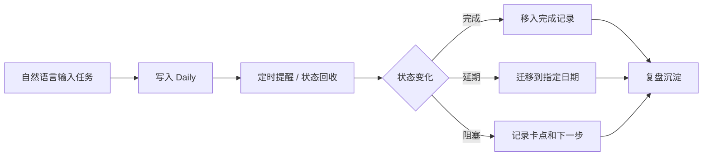
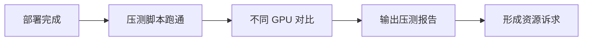

# LR AI 提效分享：用 Codex 管理日常事务

## 1. 一句话结论

Codex 不只是一个问答工具，也可以作为“个人事务操作台”：记录待办、定期追问、执行动作、沉淀复盘。

这类 AI 提效的关键不是“帮我写一段文字”，而是让 AI 持续维护任务状态，减少人脑在记忆、追踪、复盘上的负担。

## 2. 解决什么问题

日常事务管理里，真正消耗精力的通常不是某个任务本身，而是这些过程：

| 问题 | 传统方式 | Codex 方式 |
| --- | --- | --- |
| 忘记待办 | 手动记在 Todo 或聊天里 | 自然语言输入，自动写入 Daily |
| 状态断档 | 做完了但没更新 | 定时追问并回收状态 |
| 提醒噪音 | 闹钟只会重复提醒 | 已完成的事项自动从提醒中移除 |
| 复盘困难 | 事后靠回忆 | 基于 Daily 形成复盘和建议 |
| 协作动作零散 | 手动提醒人、约会议 | 可扩展为发消息、群提醒、订会议室 |

## 3. 整体流程



可以把它理解成一个轻量任务状态机：

```text
新增 -> 拆分 -> 提醒 -> 更新 -> 完成/延期/阻塞 -> 复盘
```

## 4. 三类核心能力

### 4.1 记录待办，并定期回收状态

用户只需要用自然语言输入：

```text
今天 ToDo：
1. 整理司机助手整体介绍文档，包括框架图、模块介绍
2. 梳理 LR AI 提效分享
3. 梳理司机助手供需沟通位需求
```

Codex 自动写入 Daily：

```md
## 今日 ToDo

- #todo 整理司机助手整体介绍文档，包括框架图、模块介绍。
- #todo 梳理 LR AI 提效分享。
- #todo 梳理司机助手“供需沟通位”需求。
```

然后可以设置周期提醒：

| 时间 | 提醒内容 |
| --- | --- |
| 早上 10 点 | 问今天要做什么，并总结昨天完成情况 |
| 每 2 小时 | 回看核心事项，问“卡在哪一项，下一步是什么” |
| 晚上 8 点 | 回收完成状态，并做当天复盘 |

重点：提醒不是固定文本，而是基于当前任务状态动态收敛。

### 4.2 记录待办，并执行动作

事务管理不只包括“记下来”，还包括“帮我推进一下”。

可以扩展的动作包括：

| 动作类型 | 示例 |
| --- | --- |
| 个人提醒 | 明天上午 10 点提醒我和国华对齐策略时间点 |
| 群提醒 | 周五 5 点提醒大家提交 skill 评估结果 |
| 私信提醒 | 给某人发消息确认需求评审时间 |
| 日历动作 | 预约会议室，生成会议 agenda |
| 文档动作 | 根据几天 Daily 生成复盘网页或周报 |

示例：

```text
每两个小时提醒我看一下今天核心事项。
晚上 8 点问我哪些完成了，哪些没完成，明天继续什么。
```

Codex 会把提醒范围持续更新。例如 FishFlow 和 skill 评估完成后，就不再提醒这两项，只提醒剩余事项。

### 4.3 复盘事项，输出改进建议

Codex 可以把几天的 Daily 整理成日历视图和复盘结论。

复盘关注四类问题：

| 复盘问题 | 产出 |
| --- | --- |
| 哪些任务完成了 | 完成清单 |
| 哪些任务延期了 | 延期清单和原因 |
| 哪些任务反复出现 | 阻塞点识别 |
| 哪类任务耗时超预期 | 改进建议 |

这次对话中已经生成过一个日历复盘网页：

```text
Knowledge/Daily/calendar-review-2026-05-08-to-05-13.html
```

## 5. 真实案例：这段对话里发生了什么

### 5.1 起点：一组松散待办

最开始只是几条自然语言：

```text
完成司机助手 PRD 细节确认；
拉齐司机助手整体时间节点；
部署 Qwen3；
压测不同 GPU 效率；
走通 SFT 和 RL 流程。
```

Codex 将其拆成 Daily 待办，并记录压测代码路径：

```text
/nfs/dataset-ofs-661-142656/llm_train/bench_intent.py
```

### 5.2 中间：持续回收状态

后续状态被逐步更新：

| 事项 | 状态变化 |
| --- | --- |
| 司机助手 PRD | 主体确认完成，剩余“打断处理” |
| 打断处理调研 | 后续完成 |
| Qwen3 部署 | 遇到 3.6 卡点，后续完成 |
| Qwen3 压测 | 从未完成变成已完成 |
| 压测报告 | 已完成 |
| 司机助手资源诉求 | 已输出 |
| FishFlow 论文分享 | 已完成 |
| skill 评估流程及人员 check | 已完成 |
| 语音助手方案决策逻辑 | 已完成 |

### 5.3 收敛：提醒越来越少

提醒范围从一开始的多事项：

```text
FishFlow、skill 评估、Qwen3 压测、司机助手资源诉求、国华对齐、AutoResearchClaw
```

逐步收敛为：

```text
国华对齐、AutoResearchClaw
```

这说明 Codex 不是重复播报，而是在维护状态。

### 5.4 结果：形成可复盘资产

最终形成了三类资产：

- Daily 记录：每天做什么、完成什么、延期什么。
- 日历网页：按日期展示事项流转。
- 复盘建议：提炼任务规划中的问题。

## 6. 复盘出的改进点

### 6.1 任务颗粒度要更清楚

“完成 Qwen3 压测”其实包含多个阶段：



如果只写成一个待办，就容易低估时间。

更好的写法：

```md
- #todo Qwen3 部署完成
- #todo 压测脚本跑通
- #todo 完成不同 GPU 对比
- #todo 输出压测报告
- #todo 输出司机助手资源诉求
```

### 6.2 部署类任务要预留排障时间

这次 Qwen3 部署遇到了 3.6 卡点，说明基础设施类任务不能按理想路径估时。

建议：

- 部署、压测、训练链路默认加 30% 到 50% buffer。
- 每个技术任务都记录“预期交付物”和“可能卡点”。
- 卡点出现时，不只记录“没完成”，还记录“下一步排查动作”。

### 6.3 涉及他人的事项要单独跟踪

“和国华对齐司机助手策略时间点”不是纯个人任务，应该单独记录：

```md
- #todo 和国华对齐司机助手策略时间点
  - owner：我 + 国华
  - 截止时间：本周内
  - 当前状态：待约时间 / 待反馈 / 已确认
```

否则它会混在个人待办里，变成长期尾巴。

### 6.4 每天核心事项最好不超过三件

这次 5 月 12 日的核心事项收敛后比较清楚：

1. FishFlow 论文分享整理。
2. skill 评估流程及人员 check。
3. Qwen3 压测报告和资源诉求。

这个结构更适合执行。超过三件时，Codex 可以提醒做优先级取舍。

## 7. 推荐展示 Demo

分享时可以用一个 3 分钟 Demo：

### Step 1：输入今天任务

```text
今天 ToDo：
整理司机助手整体介绍文档；
梳理 LR AI 提效分享；
梳理司机助手供需沟通位需求。
```

### Step 2：Codex 写入 Daily

```md
## 今日 ToDo

- #todo 整理司机助手整体介绍文档，包括框架图、模块介绍。
- #todo 梳理 LR AI 提效分享。
- #todo 梳理司机助手“供需沟通位”需求。
```

### Step 3：设置提醒

```text
每两个小时提醒我回看今天核心事项。
晚上 8 点做复盘。
```

### Step 4：中途更新状态

```text
FishFlow 论文分享整理 done。
skill 评估流程及人员 check done。
```

### Step 5：Codex 收敛剩余事项

```text
当前剩余：
1. Qwen3 压测报告和司机助手资源诉求
2. 和国华对齐策略时间点
3. AutoResearchClaw 写论文效果评估
```

### Step 6：生成复盘

```text
把这几天的事情整理成日历网页，并复盘有哪些改进点。
```

输出：

- 日历视图。
- 完成/延期/阻塞清单。
- 改进建议。

## 8. 观众应该带走什么

这套方法的价值可以概括为三句话：

1. 用自然语言创建任务，降低记录成本。
2. 用定时追问维护状态，减少遗忘和提醒噪音。
3. 用过程记录生成复盘，让日常事务沉淀成可改进的资产。

如果只把 AI 当写作工具，收益是单点的；如果让 AI 参与任务状态维护，收益会变成持续的。
