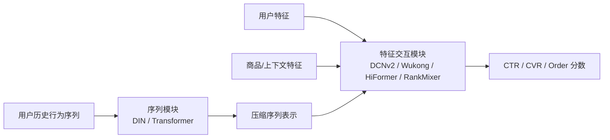
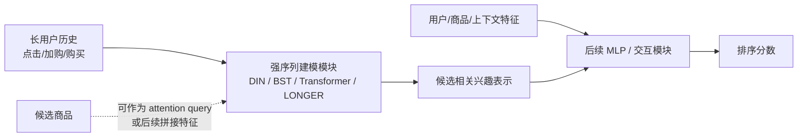
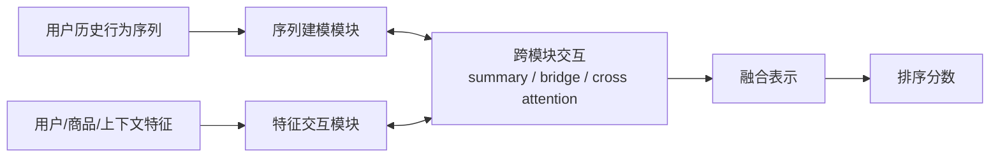
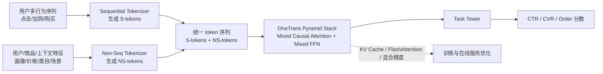
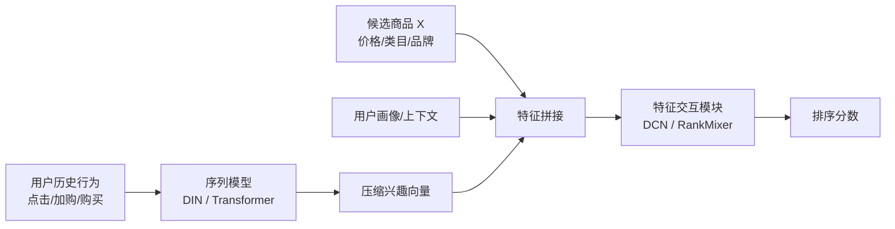
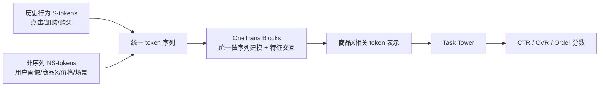
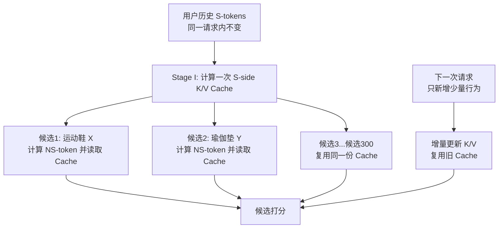
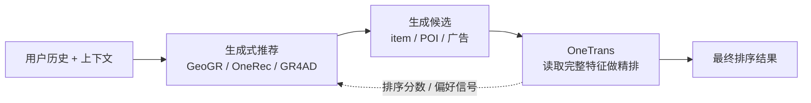

# OneTrans 技术分享：用一个 Transformer 统一特征交互与序列建模

## 论文信息

- 论文：OneTrans: Unified Feature Interaction and Sequence Modeling with One Transformer in Industrial Recommender
- 作者：Zhaoqi Zhang, Haolei Pei, Jun Guo, Tianyu Wang, Yufei Feng, Hui Sun, Shaowei Liu, Aixin Sun
- 机构：ByteDance, Nanyang Technological University
- 版本：arXiv:2510.26104v3，2026-02-02
- 会议：The Web Conference 2026，camera-ready forthcoming
- 论文链接：https://arxiv.org/abs/2510.26104
- PDF：../Papers/OneTrans_Unified_Feature_Interaction_and_Sequence_Modeling_with_One_Transformer_in_Industrial_Recommender.pdf

## 一句话总结

OneTrans 把推荐排序模型里原本分开的“用户行为序列建模”和“非序列特征交互”合并到同一个因果 Transformer backbone 中，用统一 token 序列、混合参数化、金字塔式 token 收缩和跨请求 KV Cache，让推荐排序模型可以像 LLM 一样整体扩展，并在字节工业场景线上 A/B 中带来显著收益。

## 背景：为什么需要 OneTrans

工业推荐排序常见结构是 DLRM 风格的级联排序模型。召回先从海量候选中取出几百个 item，排序模型再根据用户、候选 item、上下文和历史行为序列预测 CTR、CVR 等目标。

传统排序模型通常有两条独立演进路线：

1. 序列建模模块：例如 DIN、Transformer、LONGER，用用户历史行为序列理解兴趣。
2. 特征交互模块：例如 DCNv2、Wukong、HiFormer、RankMixer，用非序列特征做高阶交叉。

这种“先压缩序列，再和非序列特征拼接交互”的结构有两个问题：

- 信息流被截断：用户静态特征、候选 item 特征、上下文特征很难在早期反向影响序列表示。
- 系统执行割裂：序列模块和交互模块分别设计、分别扩展、分别优化，不利于复用 Transformer 生态里的 FlashAttention、KV Cache、混合精度等成熟优化。

OneTrans 的核心动机是：既然序列建模和特征交互本质上都是 token 间的信息交换，为什么不用一个统一 Transformer 来做？

## 这篇文章到底要解决什么问题

这篇文章针对的是工业推荐排序阶段里的一个核心问题：如何在一个模型里同时做好“用户行为序列建模”和“非序列特征交互”，并且让这个模型可以继续变大、变深、变长，同时还能在线上服务。

更具体地说，排序模型面对的是一个候选 item 和一个用户上下文：

- 用户历史行为：点击、加购、购买、浏览等多条行为序列。
- 用户、商品、上下文特征：用户画像、商品类目、价格、统计特征、场景、时间等。
- 预测目标：这个用户是否会点击、是否会下单、是否会转化。

传统系统通常把这两类信息分开处理：先用序列模型把用户历史压成一个兴趣向量，再把这个兴趣向量和各种非序列特征拼起来，交给特征交互模块。问题是，一旦序列被提前压缩，后面的商品特征、场景特征就很难深度影响序列理解；反过来，序列里的细粒度行为也很难在每一层都参与非序列特征交互。

所以 OneTrans 想解决的不是“再做一个更强的 DIN”或者“再做一个更强的 DCN”，而是解决推荐排序模型长期分裂成两个模块的问题：序列建模和特征交互能不能统一到同一个 backbone 里共同优化、共同扩展、共同部署。

## 之前大家怎么尝试解决这个问题

可以把已有方法分成三类。

第一类是强化特征交互模块。

- DCNv2、DeepFM 这类模型关注 user、item、context 等非序列特征之间的高阶交叉。
- Wukong 通过堆叠 Factorization Machine 类模块来扩展高阶交互能力。
- HiFormer、RankMixer 把特征组织成 token，用 Transformer 或 token mixing 思路做更强的特征交互。

补充：RankMixer 是这条路线里的一个强特征交互模型，可以把它理解成“面向排序场景的 token mixing 架构”。它先把大量非序列特征组织成多个 feature token，然后通过硬件友好的 token mixing 和 token-specific FFN 来做高阶特征交互。它的目标不是主要建模用户长行为序列，而是让 user、item、context 等非序列特征在 token 维度上充分交互，并且在参数量变大时还能保持较好的效率和 scaling 效果。

一个简化理解是：

```text
用户特征 / 商品特征 / 上下文特征
        -> feature tokens
        -> token mixing
        -> token-specific FFN
        -> 排序分数
```

所以在 OneTrans 论文里，`RankMixer + Transformer` 是一个很强的非统一 baseline：RankMixer 负责非序列特征交互，Transformer 负责用户行为序列建模，但二者仍然是两个模块拼起来。OneTrans 要超越的正是这种“强特征交互模块 + 强序列模块”的组合。

这类方法的抽象架构是：序列侧先被另一个模块处理成压缩向量，然后特征交互模块重点增强非序列特征之间的高阶组合。



这条路线的问题是：它主要增强非序列特征之间的交互，但用户长行为序列通常还是由另一个序列模块提前处理好，再把压缩结果喂进来。序列信息已经被压扁了。

第二类是强化序列建模模块。

- DIN 通过候选 item 对历史行为做 attention，建模用户兴趣。
- BST、Transformer 类方法用 self-attention 处理行为序列。
- LONGER 把 causal Transformer 用到更长的用户历史上，证明长序列扩展能带来收益。

这类方法的抽象架构是：把主要容量放在用户历史序列内部，让模型更好理解用户兴趣演化，再把序列表示交给后面的排序/交互模块。



这条路线的问题是：它主要让“历史行为内部”建模更强，但非序列特征交互仍然在另一个模块里完成。比如价格、类目、场景、用户画像对序列理解的影响，通常不是在完整 backbone 中逐层发生的。

第三类是试图连接两者。

- InterFormer 这类方法尝试让序列模块和特征交互模块之间做双向信息交换。

这类方法的抽象架构是：序列建模和特征交互仍然是两个模块，但中间加了交叉连接，让两个模块交换摘要信息。



这类方法已经看到了问题，但仍然保留了两个模块，只是在两个模块之间加桥。它缓解了信息隔离，却没有彻底变成一个统一计算图，因此结构更复杂，执行也更碎片化，不利于整体 scaling 和系统优化。

OneTrans 的判断是：之前大家都在增强局部模块，或者在两个模块之间搭桥；它要做的是把桥拆掉，让二者从一开始就在同一个 Transformer 里交互。

三类路线可以这样对比：

| 路线 | 代表方法 | 主要增强点 | 结构短板 |
| --- | --- | --- | --- |
| 强化特征交互 | DCNv2, Wukong, HiFormer, RankMixer | 非序列特征高阶交叉 | 序列通常先被压缩，细粒度行为信息进入较晚 |
| 强化序列建模 | DIN, BST, Transformer, LONGER | 用户历史兴趣建模，尤其是长序列 | 非序列特征交互仍在后置模块里完成 |
| 桥接两类模块 | InterFormer 等 | 让序列模块和交互模块交换信息 | 仍是双模块结构，执行碎片化，整体 scaling 不够自然 |
| OneTrans | 本文方法 | 序列建模和特征交互统一到一个 backbone | 需要解决 token 异质性、缓存、长序列成本等工程问题 |

## OneTrans 整体框架与流程

OneTrans 的解法可以概括成一句话：把用户行为序列和非序列特征都变成 token，拼成一个统一序列，再用一个适配推荐场景的 causal Transformer 同时做序列建模和特征交互。

整体流程可以按“输入、token 化、统一交互、任务输出、工程优化”五步理解。

1. 输入层

   输入包括用户多行为序列 S，以及非序列特征 NS。S 包括点击、加购、购买等事件；NS 包括用户画像、商品信息、上下文特征。

2. Tokenizer

   序列特征通过 Sequential Tokenizer 变成 S-token，多条行为序列可以按时间混排，也可以按行为强度拼接并用 [SEP] 分隔。非序列特征通过 Non-Seq Tokenizer 变成 NS-token，论文里 Auto-Split Tokenizer 效果更好。

   这一层的特点是：不再把“行为序列”和“普通特征”送进两个独立模块，而是先统一成 token 语言。

3. OneTrans Pyramid Stack

   统一 token 序列进入多层 OneTrans Block。每个 block 是 pre-norm causal Transformer，但 attention 和 FFN 使用 mixed parameterization。随着层数加深，pyramid 机制逐步减少 query token。

   这一层的特点是：在同一个 backbone 里同时完成历史行为内部建模、跨行为序列建模、非序列特征交互，以及序列和候选商品/上下文之间的交互。

4. Task Tower

   最终 token 表示进入多任务 tower，预测 CTR、CVR 等目标。

5. 训练与部署优化

   通过 Cross-request KV Cache、FlashAttention、混合精度和 recomputation 降低训练和推理成本。论文里 OneTransL 虽然有 330M dense 参数，但 p99 latency 仍能做到和 10M 参数的 DCNv2+DIN 接近甚至略低。

   这一层的特点是：模型结构本身服务于系统优化。causal attention 让用户历史成为可缓存前缀，pyramid stack 降低长序列成本，KV Cache 避免在多候选之间重复计算用户历史。

整体框架可以用下面这张图理解：



这张图里最重要的变化是：传统模型把“序列建模”和“特征交互”拆成两个模块，OneTrans 则把它们统一到 `OneTrans Pyramid Stack` 里。它的几个设计特点不会在总览里展开太多，后面会分别放到 tokenizer、mixed parameterization、causal attention、pyramid stack 和 KV Cache 这些模块里讲。

## 用一个例子串起来

假设我们在电商首页给用户 A 排序，召回阶段已经取回了 300 个候选商品。现在要判断候选商品“运动鞋 X”该排多靠前。

### 传统模型会怎么做

用户 A 的历史行为可能是：

```text
昨天点击：跑步袜、运动短裤、运动鞋测评
今天加购：某品牌跑鞋
过去购买：健身手环、瑜伽垫
```

传统结构通常先让 DIN 或 Transformer 看这些行为，再压成一个“用户近期对运动装备感兴趣”的向量。然后把这个向量和商品 X 的价格、类目、品牌、折扣、用户画像、时间场景等特征拼起来，交给 DCN、RankMixer 等特征交互模块。

这里的损失是：序列模型在压缩历史时，可能还不知道当前候选是“运动鞋 X”。如果候选是“运动鞋”，历史里的“跑鞋测评”和“加购跑鞋”非常关键；如果候选是“瑜伽垫”，关键行为又不一样。候选 item、场景、用户画像对历史行为的解释，最好不是在序列压缩之后才发生。

传统链路可以画成这样：



这张图里最关键的问题是：用户历史已经先被压成一个兴趣向量，候选商品 X 很晚才进入模型。也就是说，模型先概括用户兴趣，再解释当前候选，二者不是从一开始就共同建模。

### OneTrans 会怎么做

OneTrans 会先把用户历史变成 S-token：

```text
[点击:跑步袜] [点击:运动短裤] [点击:运动鞋测评] [SEP]
[加购:品牌跑鞋] [SEP]
[购买:健身手环] [购买:瑜伽垫]
```

再把候选商品和上下文变成 NS-token：

```text
[用户画像token] [候选商品token:运动鞋X] [价格/折扣token] [场景token:首页信息流]
```

拼成一个统一序列：

```text
[历史行为 S-tokens ...] [用户画像 NS] [商品X NS] [价格折扣 NS] [场景 NS]
```

进入 OneTrans 后，会发生几类交互：

- 历史行为内部交互：模型知道“点击测评”和“加购跑鞋”之间有关联。
- 多行为序列交互：购买、加购、点击之间可以互相补充。
- 非序列特征交互：商品类目、价格、折扣、用户画像之间做高阶交叉。
- 序列和特征交互：商品 X 是运动鞋，因此模型可以更关注“跑鞋测评”和“加购跑鞋”；如果当前时间是晚间促销，价格和折扣 token 也会影响最终表示。

最后，商品 X 对应的 NS-token 聚合了用户历史、商品自身、价格折扣、上下文等信息，进入 tower 输出 CTR/CVR/order 相关分数。

OneTrans 的链路可以画成这样：



与传统链路相比，这里不是先把序列压扁再拼接，而是让历史行为、候选商品、价格折扣、上下文从进入 backbone 开始就处在同一个 token 空间里。

### 在线上 300 个候选时怎么省计算

对用户 A 的这次请求，300 个候选共享同一段用户历史行为。OneTrans 可以先算一次 S-token 的 K/V cache。之后每个候选商品只算自己的 NS-token，并读取这份缓存。

如果用户 A 过几分钟又刷新了一次首页，中间只新增了一个点击行为，那么跨请求 cache 可以复用之前的历史，只增量计算这个新行为。这个设计就是论文里“统一框架”和“工业可部署”之间最关键的连接点。

缓存复用可以这样看：




## 关键设计细节

### 1. 非序列特征 Tokenizer

论文比较了两种非序列特征 token 化方式：

- Group-wise Tokenizer：人工按语义分组，每组过一个 MLP，类似 RankMixer。
- Auto-Split Tokenizer：所有非序列特征先拼接，经一个 MLP 投影后自动切分成多个 token。

实验中 Auto-Split 更好。一个重要原因是它减少了手工分组依赖，也降低了多组 MLP 带来的 kernel launch 开销。

例子：假设要给“运动鞋 X”打分，非序列特征里有用户年龄、性别、城市、商品类目、品牌、价格、折扣、店铺质量、当前时段等。Group-wise 做法需要人先决定“用户画像一组、商品基础信息一组、价格促销一组、上下文一组”。但真实业务里特征关系未必这么规整，比如“城市 + 当前时段 + 折扣”可能共同影响下单意愿，“用户年龄 + 品牌 + 价格带”也可能是一组更强的交互。Auto-Split 的做法是先把这些特征整体投影，再自动切成多个 NS-token，让模型自己学哪些信息该组合到同一个 token 里。分享时可以说：Group-wise 像人工整理货架，Auto-Split 像让模型自己按最终目标重新打包特征。

补充追问：Auto-Split 的代价是可解释性会弱一些。Group-wise 至少能说清楚“这个 token 对应用户画像，那一个 token 对应商品信息”；Auto-Split 切出来的 NS-token 是模型自动组织的混合表示，不一定能直接映射回人工语义组。如果业务需要特征诊断、归因分析、人工干预，这一点需要额外设计解释工具。

### 2. 序列特征 Tokenizer

用户可能有多种行为序列，每个事件由 item id 及 side information 组成。OneTrans 先用序列对应的 MLP 将事件投影到统一维度，再合并多行为序列。

合并方式有两种：

- Timestamp-aware：按时间顺序混排所有行为，并加行为类型标识。
- Timestamp-agnostic：按行为意图强度拼接，例如购买、加购、点击，并用可学习的 [SEP] 分隔。

当时间戳可用时，Timestamp-aware 效果更好；如果无法按时间混排，[SEP] token 对区分多行为序列有帮助。

例子：用户 A 的历史是上午点击“运动鞋测评”，中午加购“品牌跑鞋”，晚上购买“跑步袜”。如果用 Timestamp-aware，序列会保留真实发生顺序：

```text
[点击:运动鞋测评] -> [加购:品牌跑鞋] -> [购买:跑步袜]
```

模型能看到兴趣从“研究”到“加购”再到“购买配件”的演化。如果没有可靠时间戳，也可以按行为强度组织：

```text
[购买:跑步袜] [SEP] [加购:品牌跑鞋] [SEP] [点击:运动鞋测评]
```

这里 [SEP] 的作用不是装饰，而是告诉模型“购买、加购、点击是不同来源的行为段”。否则模型可能把三个行为混成一条普通列表，分不清哪个行为代表强意图，哪个只是弱兴趣。

### 3. OneTrans Block：混合参数化

推荐系统的 token 不像文本 token 那样同质。文本里的 token 大多来自同一个词表，可以共享同一套 Transformer 参数；但推荐里的 token 很杂：点击行为、购买行为、商品价格、用户年龄、类目、上下文时间，它们语义差异很强。

OneTrans 没有简单套标准 Transformer，而是在 Q/K/V 和 FFN 上采用 mixed parameterization：

- 所有 S-token 共享一套 Q/K/V 和 FFN 参数，因为它们都是用户行为事件。
- 每个 NS-token 使用 token-specific 的 Q/K/V 和 FFN 参数，因为用户、商品、上下文等非序列 token 语义差异更大。

这个设计的特点是：计算图统一，但参数不完全一刀切共享。它既保留了统一 backbone 的优势，也让不同类型的非序列特征有自己的表达空间。

具体逻辑可以拆成 attention 和 FFN 两部分。

在 attention 里，每个 token 都要先从自己的表示 x_i 投影出 q_i、k_i、v_i。OneTrans 的规则是：

```text
如果 token 是 S-token:
    q_i = W_Q^S x_i
    k_i = W_K^S x_i
    v_i = W_V^S x_i

如果 token 是第 j 个 NS-token:
    q_i = W_Q^NS[j] x_i
    k_i = W_K^NS[j] x_i
    v_i = W_V^NS[j] x_i
```

也就是说，所有行为序列 token 共享同一组序列侧投影矩阵 `W_Q^S / W_K^S / W_V^S`；但不同 NS-token 有自己的投影矩阵，比如用户画像 token 一套、商品 token 一套、价格/折扣 token 一套、上下文 token 一套。

在 FFN 里也是同样的规则：

```text
如果 token 是 S-token:
    FFN_i = FFN^S(x_i)

如果 token 是第 j 个 NS-token:
    FFN_i = FFN^NS[j](x_i)
```

所以 Mix Parameterization 不是混合不同 token 的表示，而是混合“参数共享策略”：序列 token 共享参数，非序列 token 按 token 位置或 token 类型使用专属参数。

可以用一张表理解：

| token 类型 | 例子 | Q/K/V 参数 | FFN 参数 | 设计原因 |
| --- | --- | --- | --- | --- |
| S-token | 点击商品、加购商品、购买商品 | 所有 S-token 共享 | 所有 S-token 共享 | 都是行为事件，语义结构相近，且数量很多，共享参数更省 |
| NS-token 1 | 用户画像 | 专属参数 | 专属参数 | 用户属性和商品/场景语义不同 |
| NS-token 2 | 候选商品 | 专属参数 | 专属参数 | 商品 token 要强表达候选 item 特征 |
| NS-token 3 | 价格/折扣 | 专属参数 | 专属参数 | 数值、促销类特征需要不同处理方式 |
| NS-token 4 | 上下文场景 | 专属参数 | 专属参数 | 时间、入口、场景对排序影响方式不同 |

这样做的好处是：S-token 数量可能有上千个，如果每个行为 token 都给专属参数，参数量会爆炸；但 NS-token 通常只有十几个，可以承受 token-specific 参数，并且它们的语义差异确实值得特化。

例子：`[点击:运动鞋测评]`、`[加购:品牌跑鞋]`、`[购买:跑步袜]` 都是行为事件，可以共享一套序列 token 参数；但 `[用户画像]`、`[商品X]`、`[价格折扣]`、`[场景]` 的含义完全不同，如果强行共享一套 FFN，模型需要用同一组参数同时解释“人、货、价格、场景”，表达会比较别扭。token-specific 参数相当于给不同非序列 token 配了不同的处理器。

补充追问：token-specific 参数提升了异质特征表达能力，但如果 NS-token 数量持续变多，每个 token 都有专属 Q/K/V 和 FFN，参数量会膨胀。落地时要控制 NS-token 数量，或者考虑部分共享、分组共享、低秩适配等折中。

### 4. Pyramid Stack：逐层压缩长序列

如果每一层都保留全部长序列 token，attention 和 FFN 的成本会很高。OneTrans 的 pyramid stack 在深层只保留尾部一部分 token 发起 query，但 K/V 仍然来自完整序列。随着层数加深，query token 越来越少，最终压缩到与 NS-token 数量匹配。

这个设计的特点是：底层看完整历史，越往上越把长历史压缩进少量关键 token 和 NS-token 里。它不只是省算力，也是在做逐层信息蒸馏。

例子：用户有 1500 条历史行为。底层 block 可以让比较多的历史 token 参与计算，捕捉细粒度行为；中层开始只保留最近或尾部的一部分 query，让模型把长历史摘要到更少 token；高层主要围绕 NS-token 和少量尾部 token 聚合信息。这样商品 X 最终看到的不是 1500 条历史的原始堆叠，而是被多层 attention 压缩后的兴趣表示。

这里容易误解成“直接把前面的 token 丢掉”或者“压缩成一个 token”。更准确的理解是：每一层 attention 时，K/V 仍然来自当前层的完整 token 序列；但只有尾部一部分 token 发起 query，算完后只保留这些 query token 对应的输出继续往上传。也就是说，前面的历史 token 会先被后面的 query token 读取，它们的信息被汇入后面的表示里，然后这些前面 token 自己不再作为独立 token 进入下一层。

一个更具体的过程如下。假设初始输入是：

```text
1000 个用户历史 S-token + 8 个 NS-token
```

第一层可能是：

```text
Q: 后 512 个 S-token + 8 个 NS-token
K/V: 全部 1000 个 S-token + 8 个 NS-token
输出保留: 512 个 S-token + 8 个 NS-token
```

第二层：

```text
Q: 后 256 个 S-token + 8 个 NS-token
K/V: 上一层保留的 512 个 S-token + 8 个 NS-token
输出保留: 256 个 S-token + 8 个 NS-token
```

继续往上可以理解为：

```text
1000 + 8
-> 512 + 8
-> 256 + 8
-> 128 + 8
-> 32 + 8
-> 8 个 NS-token
```

所以 Pyramid Stack 做的是“逐层汇聚”：旧历史不是一开始被粗暴删除，而是先作为 K/V 被后面的 token 读取；随后模型只保留更靠后的 token 和 NS-token。因为在 causal attention 下，越靠后的 token 能看到越多前文，放在末尾的 NS-token 天然最适合聚合完整用户历史，并最终进入 CTR/CVR 等 task tower。

补充追问：论文里的 pyramid schedule 主要是启发式设计，例如逐层线性减少 query token。这里可以继续追问：不同业务、不同序列长度、不同候选规模下，最优收缩节奏是否一样？未来有没有可能把 schedule 学习化，或者通过 AutoML/搜索自动决定每层保留多少 token？

### 5. Causal Attention 而不是 Full Attention

消融显示 full attention 与 causal attention 指标接近，但 full attention 不利于 KV Cache。OneTrans 选择 causal attention 的重点不是单纯追求离线指标，而是为了让训练和推理都能继承 LLM 里的高效缓存与注意力优化。

例子：统一序列可以排成这样：

```text
[点击:运动鞋测评] [加购:品牌跑鞋] [购买:跑步袜] [用户画像] [商品X] [价格折扣] [场景]
```

用 causal attention 时，后面的 `[商品X]`、`[价格折扣]`、`[场景]` 可以看见前面的用户历史，因此商品 X 的表示会知道用户最近在看跑鞋、加购跑鞋、买过跑步袜。更重要的是，前面的用户历史对同一次请求里的 300 个候选都是一样的，可以先算好 K/V 缓存。Full attention 也许能让历史 token 反过来看商品 token，但这样缓存就被候选 item 污染了：换一个候选商品，历史 token 的表示也要重算。Causal attention 的取舍是：牺牲一点理论上的双向自由度，换来稳定可复用的线上计算路径。

为什么 causal attention 更容易做高效缓存？关键在于它的信息流是单向的：前面的 token 不依赖后面的 token。因此用户历史 token 的 K/V 只由用户历史本身决定，不会因为后面候选商品不同而改变。

还是看这个序列：

```text
[点击:运动鞋测评] [加购:品牌跑鞋] [购买:跑步袜] [用户画像] [商品X] [价格折扣] [场景]
```

在 causal attention 里，`[商品X]` 可以看见 `[点击:运动鞋测评]`、`[加购:品牌跑鞋]`、`[购买:跑步袜]`，但这些历史行为 token 看不见 `[商品X]`。所以当候选从“运动鞋 X”换成“瑜伽垫 Y”时，用户历史部分的 K/V 不变，可以直接复用。

如果换成 full attention，每个 token 都能看所有 token。这样 `[点击:运动鞋测评]` 也会看见 `[商品X]`。候选是“运动鞋 X”时，历史 token 的表示是一种结果；候选换成“瑜伽垫 Y”时，历史 token 又会被另一个商品影响，表示会变化。于是同一段用户历史不能在多个候选之间共享缓存。

可以用一张小表概括：

| 机制 | 用户历史是否依赖候选商品 | 用户历史 K/V 能否跨候选复用 |
| --- | --- | --- |
| Causal Attention | 不依赖后面的候选商品 | 可以复用 |
| Full Attention | 依赖所有候选商品 token | 很难稳定复用 |

所以 OneTrans 选择 causal attention 的原因不是 full attention 离线效果差，而是 causal attention 能把用户历史变成稳定的可缓存前缀。它天然适配 LLM 里的 KV Cache、causal mask、FlashAttention 等成熟优化，也更适合“一份用户历史 + 大量候选商品”的工业排序场景。

补充追问：KV Cache 能不能稳定发挥作用，取决于业务请求形态。如果候选生成方式导致每个候选都有大量 candidate-specific 序列，或者在线特征强实时变化到会影响 S-side 表示，那么缓存复用空间会变小。论文也提到候选相关序列不能直接复用共享 S-side cache，需要先聚合成 NS-token。这说明 KV Cache 不是免费午餐，它要求系统里有一部分“用户侧历史”在同一请求或相邻请求之间足够稳定。

### 6. 跨候选与跨请求 KV Cache

工业推荐的一个特点是：同一个请求里有很多候选 item，用户行为序列相同，候选 item 相关的 NS-token 不同。

OneTrans 利用这个结构做两阶段计算：

- Stage I：每个请求只计算一次 S-side，并缓存 K/V。
- Stage II：每个候选只计算自己的 NS-token，并对缓存的 S-side K/V 做 cross attention。

进一步地，用户行为序列通常是 append-only。跨请求时，可以复用上一请求缓存，只计算新增行为的 K/V，把序列侧计算从 O(L) 降到 O(delta L)。

例子：用户 A 打开首页，一次请求召回 300 个商品。用户历史是固定的：

```text
[点击:运动鞋测评] [加购:品牌跑鞋] [购买:跑步袜]
```

候选商品不同：

```text
候选1: 运动鞋 X
候选2: 瑜伽垫 Y
候选3: 蓝牙耳机 Z
...
候选300
```

如果没有 cache，模型要为每个候选都重新计算一遍用户历史，等于同一段历史重复算 300 次。有 KV Cache 后，OneTrans 先把用户历史算一次并缓存，之后 300 个候选分别拿自己的商品/价格/上下文 token 去读这份缓存。再进一步，如果用户 A 5 分钟后刷新首页，中间只多点击了一个“跑鞋尺码表”，系统只需要给这个新增行为补一小段 K/V，而不是把过去 1500 个历史 token 全部重算。这个例子能很好解释为什么论文强调 OneTrans 不只是模型结构创新，也是服务系统友好的结构创新。

补充追问：跨请求 cache 对用户行为更新频率、cache 过期策略、特征一致性要求更高。如果用户行为更新很频繁，但每次只追加少量行为，增量更新很划算；如果用户状态、上下文、实时特征经常整体刷新，则要区分哪些信息适合放进可复用的 S-side，哪些信息应该放进每个候选单独计算的 NS-side。


## 和生成式推荐路线的关系

OneTrans 容易和近两年的生成式推荐混在一起，因为它也用了 Transformer、token、causal attention、KV Cache，也强调 scaling law。但它和高德 GeoGR、快手 OneRec/GR4AD、Meta HSTU 这类生成式推荐的定位并不一样。

### 1. 两者共同点：都在把推荐往“统一大模型”方向推

这些工作有一个共同趋势：不再满足于把推荐系统拆成很多孤立模块，而是尝试用统一的 token 表示、统一的 Transformer backbone、统一的训练/服务优化来提升模型容量和扩展性。

- Meta HSTU / Generative Recommenders：把推荐看成序列转导或下一个 item 生成问题，用适配高基数、流式推荐数据的模型替代传统 sequential recommender。
- 快手 OneRec：尝试用生成式推荐统一 retrieve 和 rank，通过自回归方式生成候选 item，并用偏好对齐提升生成结果质量。
- 快手 GR4AD：面向广告推荐，用广告语义 ID、LazyAR 解码、价值感知学习和动态 beam serving，把生成式推荐落到高吞吐广告系统。
- 高德 GeoGR：面向 POI 推荐，用地理感知 semantic ID 和 LLM 多阶段训练，自回归生成用户下一步可能去的 POI。
- OneTrans：用一个 Transformer backbone 统一排序模型内部的行为序列建模和非序列特征交互。

所以它们的大方向一致：都在探索“推荐系统能否像大模型一样通过统一 token 化、统一 backbone 和规模化训练获得持续收益”。

### 2. 根本区别：OneTrans 是排序模型，生成式推荐通常是生成候选

最关键的差别在任务定义。

OneTrans 的输入是“一个用户 + 一个候选 item + 上下文”，输出是这个候选 item 的 CTR、CVR、order 等排序分数。它仍然站在传统级联推荐框架的 ranking stage 里：

```text
召回给出候选集 -> OneTrans 给每个候选打分 -> 排序输出 top item
```

生成式推荐的典型输入是用户历史和上下文，输出是 item ID、semantic ID 或 POI ID 的 token 序列。它更像是在直接生成候选：

```text
用户历史 + 上下文 -> 自回归生成 semantic ID -> 映射到 item/POI/广告
```

这意味着二者解决的问题层级不同：

- OneTrans 解决的是：给定候选后，如何更好地打分。
- 生成式推荐解决的是：能不能直接生成要推荐的东西，甚至替代或统一召回、粗排、排序。

### 3. 表示方式不同：OneTrans 的 token 是特征 token，生成式推荐的 token 多是 item 语义 ID

OneTrans 的 token 来自推荐排序特征：

- S-token：用户行为事件 token。
- NS-token：用户、商品、上下文、价格、类目等特征 token。

这些 token 的目标是服务于打分，最终进入 task tower 输出 CTR/CVR。

生成式推荐通常会把 item、POI、广告构造成 semantic ID：

- OneRec 这类工作通常通过 semantic ID 表示视频或商品，并自回归生成这些 ID。
- GeoGR 的重点是构造地理感知 POI semantic ID，让 ID 同时表达空间、时间和协同访问关系。
- GR4AD 针对广告构造 UA-SID，把多模态广告内容、协同信号和商业属性融合进广告 token。

也就是说，OneTrans 的 token 更像“排序特征的中间表示”；生成式推荐的 token 更像“可生成、可检索、可映射回 item 的目标符号”。

### 4. 结构目标不同：OneTrans 统一双塔内部，生成式推荐统一推荐链路

传统排序模型里有两个主要模块：

```text
序列建模模块 + 特征交互模块
```

OneTrans 要做的是把这两个模块统一成一个 backbone。因此它的贡献重点是：统一排序内部的信息交互，让用户历史、候选 item、上下文特征在每一层共同建模。

生成式推荐则通常想挑战更上游的级联链路：

```text
召回 -> 粗排 -> 精排 -> 重排
```

OneRec 的目标是统一 retrieve 和 rank；GeoGR 的目标是生成 POI 候选；GR4AD 的目标是在广告系统里用生成式范式替代或增强传统 DLRM stack。它们的野心更偏“链路重构”，OneTrans 的目标更偏“排序 backbone 重构”。

### 5. 工程压力不同：OneTrans 避免自回归多步生成，生成式推荐要解决解码成本

OneTrans 对每个候选打分，本质上还是 discriminative scoring。它需要处理大量候选，但不需要一步步生成 item ID。因此它的工程优化重点是：

- 同请求候选共享 S-side cache。
- 跨请求复用用户行为 KV Cache。
- Pyramid stack 降低长序列 attention 成本。
- FlashAttention、混合精度、recomputation 提升训练和推理效率。

生成式推荐要自回归生成 semantic ID，天然有解码成本和 beam search 成本。因此它们常常需要专门设计服务策略：

- GR4AD 的 LazyAR 放松层级依赖，降低多候选生成成本。
- GR4AD 的 Dynamic Beam Serving 根据生成层级和线上负载动态调整 beam。
- OneRec 类方法需要处理生成候选和排序偏好之间的对齐问题。
- GeoGR 需要解决 LLM 与 POI semantic ID 之间的对齐问题。

一句话：OneTrans 的难点是“大量候选打分怎么共享计算”；生成式推荐的难点是“自回归生成候选怎么又准又快”。

### 6. 二者不是替代关系，更像上下游互补

在工业推荐系统里，可以把它们放在同一条链路上理解：



一个可能的组合方式是：

1. 用 GeoGR/OneRec/GR4AD 这类生成式模型，根据用户历史生成一批候选 item、POI 或广告。
2. 再用 OneTrans 读取完整用户行为、候选 item 特征、上下文特征，对这些候选做精排。
3. 如果业务希望进一步端到端，可以把 OneTrans 的排序分数作为 reward 或偏好信号，反向指导生成式候选模型。

所以 OneTrans 并不是“反生成式推荐”。它更像是在当前工业排序体系里，吸收生成式/LLM 技术栈的工程优点，但保留判别式排序模型的稳定性、特征丰富性和线上可控性。

补充追问：OneTrans 更适合粗排、精排，还是多阶段排序里的统一 backbone？从论文设置看，它主要针对 ranking stage，并且使用丰富的用户、item、上下文特征和多任务 tower，更接近精排或高精度排序模型。它也有做粗排 backbone 的潜力，但要看候选规模和延迟预算：候选越多，NS-side per-candidate 计算越敏感；特征越丰富，越接近精排优势区。和生成式推荐结合时，一个自然分工是生成式模型负责更上游的候选产生，OneTrans 负责候选集合内的高精度打分。

## OneTrans 与生成式推荐对比表

| 维度 | OneTrans | 高德 GeoGR / 快手 OneRec、GR4AD 等生成式推荐 |
| --- | --- | --- |
| 主要阶段 | 精排/排序阶段 | 召回、生成候选，或统一召回与排序 |
| 核心任务 | 给定候选 item，预测 CTR/CVR/order 分数 | 自回归生成 item/POI/广告 semantic ID |
| token 含义 | 用户行为 token + 用户/item/上下文特征 token | item/POI/广告的语义 ID token |
| 模型范式 | 判别式打分模型 | 生成式候选模型 |
| 统一对象 | 统一序列建模和特征交互 | 统一检索、生成、排序或业务目标对齐 |
| 工程难点 | 多候选共享计算、长序列缓存、低延迟打分 | 自回归解码、beam search、semantic ID 对齐、生成结果排序 |
| 优势 | 保留丰富排序特征，容易接入现有 ranking stack | 有机会重构召回/排序链路，减少级联系统割裂 |
| 关系 | 可作为生成式候选后的精排模型 | 可为 OneTrans 提供更高质量候选 |

## 实验结论

### 离线效果

论文在 29.1B impressions、27.9M 用户、10.2M item 的工业数据集上评估 CTR/CVR 的 AUC 和 UAUC。

相对 DCNv2 + DIN 基线：

- RankMixer + Transformer：CTR UAUC +0.90%，CVR UAUC +0.75%。
- OneTransS：CTR UAUC +1.77%，CVR UAUC +1.66%。
- OneTransL：CTR UAUC +2.79%，CVR UAUC +3.23%。

备注：OneTransS 和 OneTransL 是同一套架构的不同规模版本。

- OneTransS：更接近 100M 参数量级，论文配置是 6 层 OneTrans block，隐藏维度 d=256，4 个 attention heads；pyramid schedule 将序列 query token 从约 1190 逐层收缩到 12。
- OneTransL：更大的默认线上版本，约 330M dense 参数，论文配置是 8 层 OneTrans block，隐藏维度 d=384；pyramid schedule 将序列 query token 从约 1500 逐层收缩到 16。

可以理解为：OneTransS 证明统一框架在接近强 baseline 参数规模时已经有效；OneTransL 则进一步扩大 depth、width 和可处理序列长度，验证 OneTrans 沿模型规模和序列长度继续扩展时仍能获得更高收益。

这说明统一建模不是简单换 backbone，而是明显超过“强特征交互模块 + 强序列模块”的组合。

### 输入设计与 OneTrans Block 消融

Table 3 用 OneTransS 作为 reference，考察输入设计和 OneTrans block 设计的影响。表里的数值是相对 OneTransS 的下降或变化。

| 类型 | 变体 | CTR AUC | CTR UAUC | CVR AUC | CVR UAUC | Params | TFLOPs |
| --- | --- | --- | --- | --- | --- | --- | --- |
| Input | Group-wise Tokenizer | -0.10% | -0.30% | -0.12% | -0.10% | 78M | 2.35 |
| Input | Timestamp-agnostic Fusion | -0.09% | -0.22% | -0.20% | -0.21% | 91M | 2.64 |
| Input | Timestamp-agnostic Fusion w/o Sep Tokens | -0.13% | -0.32% | -0.29% | -0.33% | 91M | 2.62 |
| OneTrans Block | Shared parameters | -0.15% | -0.29% | -0.14% | -0.29% | 24M | 2.64 |
| OneTrans Block | Full attention | +0.00% | +0.01% | -0.03% | +0.06% | 91M | 2.64 |
| OneTrans Block | w/o pyramid stack | -0.05% | +0.06% | -0.04% | -0.42% | 92M | 8.08 |

这组消融可以这样读：

1. Auto-Split Tokenizer 优于 Group-wise Tokenizer。

   Group-wise 依赖人工分组，Auto-Split 让模型自己把非序列特征投影并切成 token。Group-wise 版本 CTR UAUC 下降 0.30%，说明在这个工业数据上，人工语义分组不如模型自动组织 token。

2. Timestamp-aware Fusion 优于 Timestamp-agnostic Fusion。

   当时间戳可用时，按真实时间顺序混排行为，比按“购买、加购、点击”这类意图强度静态排序更好。Timestamp-agnostic Fusion 让 CTR UAUC 下降 0.22%，CVR UAUC 下降 0.21%。

3. [SEP] token 对多行为序列有帮助。

   在 Timestamp-agnostic 设置下去掉 [SEP]，指标进一步下降，CTR UAUC 到 -0.32%，CVR UAUC 到 -0.33%。这说明 [SEP] 能帮助模型区分不同类型行为段，不只是一个形式上的分隔符。

4. Mixed parameterization 是关键设计。

   如果所有 token 都共享参数，参数量会从 91M 降到 24M，但 CTR/CVR UAUC 都下降约 0.29%。这说明 NS-token 的 token-specific Q/K/V 和 FFN 确实帮助模型处理用户、商品、上下文等异质特征。

5. Full attention 离线指标接近，但工程上不如 causal attention。

   Full attention 的离线 AUC/UAUC 与 causal attention 基本持平，有些指标甚至微幅上升。但它破坏了 KV Cache 的前缀复用条件，无法像 causal attention 那样把用户历史稳定缓存起来。因此论文选择 causal attention 的核心理由是系统效率，而不是离线指标明显更高。

6. Pyramid stack 用少量指标代价换来大幅算力节省。

   去掉 pyramid stack 后 TFLOPs 从 2.64 增加到 8.08，计算量约 3 倍，但指标没有明显提升，CVR UAUC 还下降 0.42%。这说明全层保留所有长序列 token 并不划算；逐层收缩 query token 可以更好地利用算力和显存。

### 系统效率

OneTransL 有 330M dense 参数，训练 TFLOPs 是 DCNv2+DIN 的 100 倍以上，但在线 p99 latency 反而略低：

- DCNv2+DIN p99：13.6 ms
- OneTransL p99：13.2 ms

关键原因是模型结构统一后，可以系统性使用：

- Pyramid stack
- Cross-request KV caching
- FlashAttention-2
- 混合精度与 recomputation

### Scaling Law

论文分别沿 length、depth、width 扩展 OneTrans。结论是：

- 增加行为序列长度收益最大，因为引入了更多用户历史证据。
- depth 和 width 都有收益，但 depth 通常更高效。
- OneTrans 的 compute-performance 曲线比 RankMixer + Transformer 更陡，说明统一 backbone 更适合继续扩展。

### 线上 A/B

对比线上控制组 RankMixer + Transformer，OneTransL 带来：

Feeds 场景：

- click/u：+7.737%
- order/u：+4.351%
- gmv/u：+5.685%
- p99 latency：-3.91%

Mall 场景：

- click/u：+5.143%
- order/u：+2.577%
- gmv/u：+3.670%
- p99 latency：-3.26%

论文还提到 Active Days +0.7478%，冷启动商品 order/u +13.59%，说明统一建模可能改善泛化能力和冷启动表现。

## 对我们做推荐系统的启发与追问

1. 统一架构可能比单点模块扩展更重要。

   当序列模块和特征交互模块分开扩展时，二者之间的信息交换会成为瓶颈。OneTrans 的优势不是某个局部模块更强，而是让推荐排序的主要信息交互都发生在同一计算图内。

2. 推荐模型 scaling 需要模型和系统一起设计。

   OneTrans 的离线增益依赖大 backbone，但线上可用性依赖 causal attention、KV Cache、pyramid stack 和 FlashAttention。如果只学模型结构，不学系统优化，很难复现论文里的部署效果。

3. 推荐 token 与文本 token 不同。

   文本 token 大体同质，可以共享参数；推荐系统里用户、item、上下文、序列事件的语义差异很强。mixed parameterization 是一个很实用的折中：序列 token 共享，非序列 token 特化。

4. 长行为序列仍然是最强的 scaling 方向之一。

   论文的 scaling 实验显示，增加 length 收益最大。这与工业直觉一致：更多真实行为历史通常比单纯加宽 MLP 更有信息量。

5. 需要警惕 token-specific 参数的膨胀。

   OneTrans 给 NS-token 使用 token-specific Q/K/V 和 FFN，是为了保留非序列特征的异质语义。但如果 NS-token 数量持续增加，每个 token 都有专属参数，参数量和工程复杂度可能变大。实际落地时需要控制 NS-token 数量，或者考虑部分共享、分组共享、低秩适配等折中方案。

6. 统一 backbone 不等于所有阶段都用同一个模型。

   OneTrans 证明排序内部可以统一建模，但是否要扩展到召回、粗排、精排全链路，还要看延迟、特征可得性和候选规模。更现实的路径可能是：生成式推荐或传统召回提供候选，轻量模型做粗筛，OneTrans 在精排或高价值场景里发挥完整特征建模能力。

## 局限与注意事项

- 论文主要基于字节内部工业数据，公开数据复现难度较高。
- 线上收益依赖强工程基础设施，包括连续请求缓存、GPU serving、混合精度和高效 attention kernel。
- NS-token 的自动切分虽然效果好，但可解释性弱于人工分组。
- Pyramid schedule 使用启发式规则，是否对不同业务和序列长度稳定仍需要验证。
- 论文关注排序阶段；在召回、粗排或生成式推荐框架中的迁移还需要进一步实验。
- token-specific 参数提升了非序列特征表达能力，但也会带来参数量随 NS-token 数增加而膨胀的问题。
- KV Cache 的收益依赖用户历史在候选之间和相邻请求之间可复用；如果业务里候选相关序列或实时特征占比过高，缓存收益会被削弱。

## 核心结论

OneTrans 的核心价值可以概括为三句话：

1. 统一建模：把序列建模和特征交互都变成一个 Transformer token 序列里的信息交换。
2. 推荐适配：用 mixed parameterization 处理推荐 token 的异质性。
3. 工程可用：用 causal attention、pyramid stack 和 KV Cache 把大模型推荐带到可上线的延迟范围。

如果用一句话收束：OneTrans 是把推荐排序模型从“模块拼装式扩展”推向“统一 backbone 式扩展”的一次工业级尝试。
