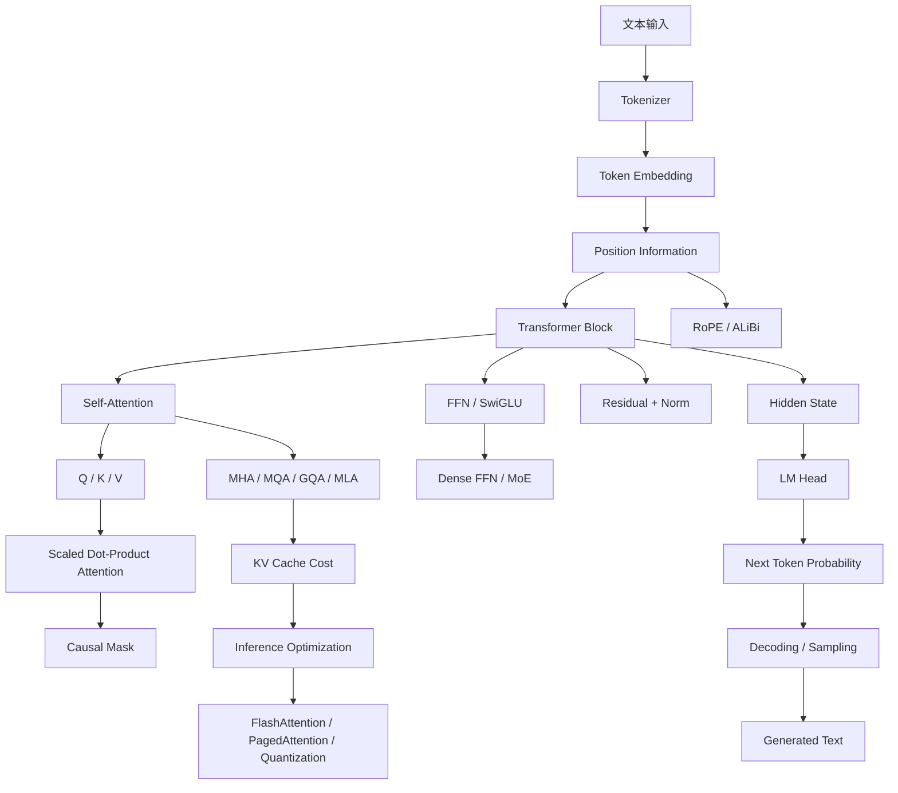

# Transformer 知识点依赖图

## 一句话结论

学习 Transformer 不应该从零散名词开始，而应该按“输入表示 -> 注意力交互 -> 位置感知 -> 非线性加工 -> 稳定训练 -> 高效推理 -> 现代架构变体”的依赖顺序学。

## 1. 总体依赖图



## 2. 第一层：文本如何进入模型

先学：

- Tokenizer。
- token id。
- token embedding。
- context length。

关键问题：

- 为什么文本不能直接输入神经网络？
- 为什么 tokenizer 会影响成本和效果？
- 为什么中文 token 数可能更敏感？

对应章节：

- [Tokenizer 与语言模型基础](./00-Tokenizer与语言模型基础.md)
- [Embedding 与向量相似度](../01-基础原理/03-Embedding与向量相似度.md)

## 3. 第二层：模型如何知道顺序

Transformer 的 Attention 本身不天然知道顺序，所以需要位置编码。

先学：

- 绝对位置编码。
- RoPE。
- ALiBi。
- 长上下文外推。

关键问题：

- 为什么 Attention 对顺序不敏感？
- RoPE 为什么能表达相对位置？
- 长上下文为什么会牵涉位置编码？

对应章节：

- [位置编码](./03-位置编码.md)

## 4. 第三层：Attention 如何交互信息

Attention 是 token 之间交换信息的核心机制。

先学：

- Q/K/V。
- scaled dot-product attention。
- softmax。
- causal mask。
- attention complexity。

关键问题：

- Q、K、V 分别像什么？
- 为什么要除以 `sqrt(d_k)`？
- 为什么训练能并行，推理却要逐 token？
- Attention 的复杂度为什么是 `O(n^2)`？

对应章节：

- [注意力机制](./02-注意力机制.md)

## 5. 第四层：一个 Transformer Block 不只有 Attention

完整 block 还包括：

- FFN。
- SwiGLU。
- residual connection。
- LayerNorm / RMSNorm。

关键问题：

- Attention 后为什么还要 FFN？
- 残差连接解决什么问题？
- LLM 为什么常用 RMSNorm？
- Pre-Norm 和 Post-Norm 有什么区别？

对应章节：

- [Transformer 架构详解](./01-Transformer详解.md)
- [归一化、残差连接与激活函数](../01-基础原理/05-归一化残差与激活函数.md)

## 6. 第五层：现代注意力变体为什么出现

标准 MHA 效果好，但推理 KV Cache 成本高。

所以现代模型常用：

- MQA。
- GQA。
- MLA。

关键问题：

- MHA、MQA、GQA、MLA 的 K/V 头数有什么区别？
- 为什么 GQA 能降低 KV Cache 显存？
- MLA 为什么会被用于 DeepSeek 类架构？

对应章节：

- [多头注意力变体](./04-多头注意力变体.md)
- [KV Cache 显存计算专题](../04-推理优化/04-KV-Cache显存计算专题.md)

## 7. 第六层：MoE 为什么能扩大模型

MoE 把 FFN 换成多个专家，通过 router 选择部分专家参与计算。

关键问题：

- MoE 为什么参数多但推理计算不等比例增加？
- router 怎么训练？
- 为什么需要负载均衡？
- MoE 有哪些通信和稳定性问题？

对应章节：

- [MoE 详解](./06-MoE详解.md)

## 8. 第七层：输出如何变成文本

Transformer 输出 hidden state 后，还要经过：

```text
hidden state -> lm_head -> logits -> softmax -> decoding
```

关键问题：

- logits 是什么？
- temperature、top-k、top-p 分别影响什么？
- 为什么解码策略不能替代模型能力？

对应章节：

- [解码与采样策略](./07-解码与采样策略.md)

## 9. 第八层：训练和推理为什么差异很大

训练时：

```text
整段序列并行计算
```

推理时：

```text
prefill 一次处理 prompt
decode 阶段逐 token 生成
```

关键问题：

- KV Cache 为什么能加速 decode？
- KV Cache 为什么又会吃显存？
- FlashAttention 优化的是训练还是推理？
- PagedAttention 解决什么显存管理问题？

对应章节：

- [KV Cache 与推理优化](../04-推理优化/02-KV-Cache优化.md)
- [FlashAttention 与 PagedAttention](../04-推理优化/03-FlashAttention与PagedAttention.md)

## 10. 推荐学习顺序

1. Tokenizer。
2. Embedding。
3. 交叉熵与 next token prediction。
4. Q/K/V 与 Attention。
5. Causal Mask。
6. 位置编码。
7. FFN、Residual、Norm。
8. Decoder-only Transformer。
9. MHA / MQA / GQA / MLA。
10. MoE。
11. KV Cache。
12. 解码策略。
13. FlashAttention / PagedAttention。
14. 主流模型架构对比。

## 学习检查

学完本章后，应该能画出一条完整链路：

```text
文本 -> token -> embedding -> transformer block -> hidden state -> logits -> 采样 -> 输出文本
```

并且能解释每一步为什么存在。
